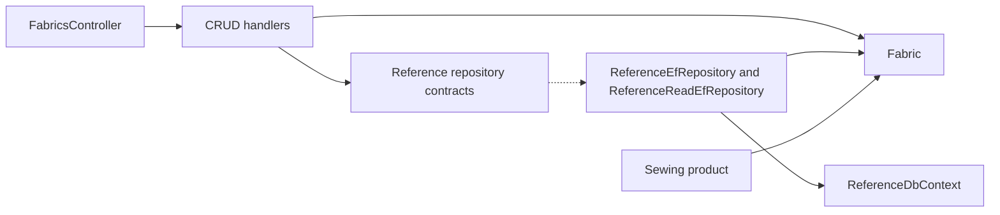

# Fabrics

**Static code review:** 2026-10-16; Calculator sheet fields and import 2026-11-02 ([REF-002](../../specs/reference/002-fabrics-accessories-sheet/README.md)). **Module:** reference.

CRUD operations and list retrieval for the “Fabrics” lookup, with the fields of the Calculator sheet «Тканини»: code (FAB-…), UA/RU name and composition, density, price and its date, activity, comment and the short description for proposals. Composition and density are also used by first-contact proposals; missing metadata blocks a proposal. `POST /api/reference/fabrics/import` loads the sheet rows sent by the admin, with a preview; rows match by code, then by name for older rows without a code.

## Structure and Relationships

[Controller](../../../../src/Modules/Reference/Reference.Api/Reference.Api/Controllers/FabricsController.cs) exposes CRUD. The [create handler](../../../../src/Modules/Reference/Reference.Application/Reference.Application/Features/Fabric/Create/CreateFabricCommandHandler.cs) and adjacent query/update/delete handlers validate the data; [Fabric](../../../../src/Modules/Reference/Reference.Domain/Reference.Domain/GarmentAccessories/Entities/Fabric.cs) is the domain entity. [ReferenceEfRepository](../../../../src/Modules/Reference/Reference.Infrastructure/Reference.Infrastructure/Repositories/ReferenceEfRepository.cs) and [ReferenceDbContext](../../../../src/Modules/Reference/Reference.Infrastructure/Reference.Infrastructure/DataBase/ReferenceDbContext.cs) persist it. Fabrics are used as part of Sewing products.

## Code Structure

Verified entry points and key feature components are shown; the tree does not list every supporting file.

```text
src/
└── Modules/Reference/
    ├── Reference.Api/Reference.Api/Controllers/FabricsController.cs  # HTTP entry point
    ├── Reference.Application/Reference.Application/Features/Fabric/
    │   ├── Create/CreateFabricCommandHandler.cs  # use case handler
    │   ├── Delete/DeleteFabricCommandHandler.cs  # use case handler
    │   ├── GetList/GetAllFabricQueryHandler.cs  # use case handler
    │   ├── Import/ImportFabricsCommandHandler.cs  # sheet import with preview
    │   ├── Shared/  # fields contract, validator, code spec
    │   └── Update/UpdateFabricCommandHandler.cs  # use case handler
    ├── Reference.Domain/Reference.Domain/GarmentAccessories/Entities/Fabric.cs  # domain model
    └── Reference.Infrastructure/Reference.Infrastructure/
        ├── DataBase/ReferenceDbContext.cs  # data context
        ├── Congigurations/FabricConfiguration.cs  # nullable bounded public metadata mapping
        ├── Migrations/20261029153930_AddFabricPresentationMetadata.cs  # additive schema
        ├── Migrations/*_AddFabricAccessorySheetFields.cs  # sheet fields, code index
        └── Repositories/ReferenceEfRepository.cs  # data access
```

## Structure Diagram


```mermaid
flowchart LR
    A["FabricsController"] --> B["CRUD handlers"]
    B --> C["Fabric"]
    B --> D["Reference repository contracts"]
    D -.-> E["ReferenceEfRepository and ReferenceReadEfRepository"]
    E --> F["ReferenceDbContext"]
    E --> C
    G["Sewing product"] --> C
```

## Tests

`tests/UnitTests/Reference/FabricPresentationMetadataTests.cs` covers metadata normalization and bounds; `tests/UnitTests/Reference/ReferenceSheetImportTests.cs` covers the sheet import. No automated tests cover this feature's CRUD operations yet. `tests/UnitTests/ReferenceProductUsageTests.cs` covers rejecting deletion of reference data used by a Product.

**Data:** [reference schema](../../architecture/data-model/reference.md)

## Related Sources

[OpenAPI](../../contracts/reference/fabrics.openapi.yaml) · [Reference boundaries](../../architecture/overview/modules.md).

Numeric price/norm edits to previously versioned records append immutable approved revisions in the same transaction. GET remains anonymous; writes require access:materials. See [pricing input versions](pricing-input-versions.md) for persistence, concurrency and precision.
